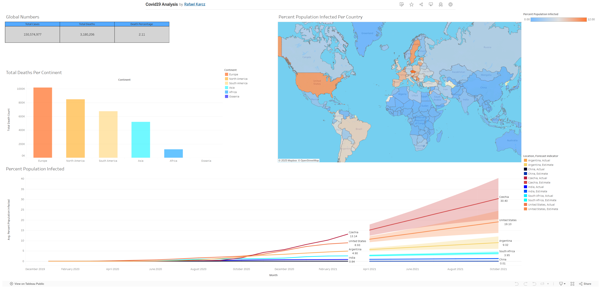

COVID-19 Global Analysis
========================

**Overview.** Tableau dashboard visualizing global COVID-19 metrics: deaths per continent, color-coded infection rate map, and monthly trends with forecast through 2021.

**Live demo:** View on Tableau Public <https://public.tableau.com/REPLACE_WITH_YOUR_COVID_URL>_

Screenshot
----------

   Dashboard overview.

Notes
-----

- Workbook (`.twbx`) intentionally omitted.
- Dataset not included; this repo serves as a portfolio preview via screenshot + live link.

License
-------

This project is licensed under the MIT License - see the LICENSE <LICENSE>_ file for details.